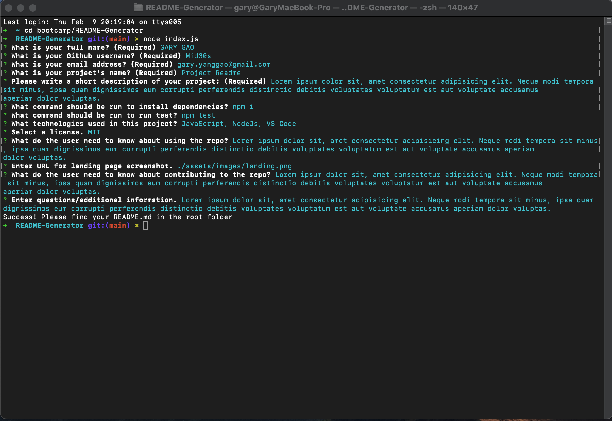

# README-Generator
  
  
  ## Description
  Lorem ipsum dolor sit, amet consectetur adipisicing elit. Neque modi tempora sit minus, ipsa quam dignissimos eum corrupti perferendis distinctio debitis voluptates voluptatum est aut voluptate accusamus aperiam dolor voluptas.

  ## Table of Content
  * [Installation](#installation)
  * [Usage](#usage)
  * [License](#license)
  * [Contribution](#Contribution)
  * [Tests](#tests)
  * [Contact](#contact)
  
  ## Made With
  
  
  ## Installation
  npm i

  ## Usage
  Lorem ipsum dolor sit, amet consectetur adipisicing elit. Neque modi tempora sit minus, ipsa quam dignissimos eum corrupti perferendis distinctio debitis voluptates voluptatum est aut voluptate accusamus aperiam dolor voluptas.
  To view this application,the following image shows the landing page of the application, or click on https://Mid30s.github.io/README-Generator
  

  ## License
  

  Link to license: https://opensource.org/licenses/MIT 

  Copyright (C) 2023 Gary GAO
  
    Permission is hereby granted, free of charge, to any person obtaining a copy of this software and associated documentation files (the "Software"), to deal in the Software without restriction, including without limitation the rights to use, copy, modify, merge, publish, distribute, sublicense, and/or sell copies of the Software, and to permit persons to whom the Software is furnished to do so, subject to the following conditions:

    The above copyright notice and this permission notice shall be included in all copies or substantial portions of the Software.

    THE SOFTWARE IS PROVIDED "AS IS", WITHOUT WARRANTY OF ANY KIND, EXPRESS OR IMPLIED, INCLUDING BUT NOT LIMITED TO THE WARRANTIES OF MERCHANTABILITY, FITNESS FOR A PARTICULAR PURPOSE AND NONINFRINGEMENT. IN NO EVENT SHALL THE AUTHORS OR COPYRIGHT HOLDERS BE LIABLE FOR ANY CLAIM, DAMAGES OR OTHER LIABILITY, WHETHER IN AN ACTION OF CONTRACT, TORT OR OTHERWISE, ARISING FROM, OUT OF OR IN CONNECTION WITH THE SOFTWARE OR THE USE OR OTHER DEALINGS IN THE SOFTWARE.
    
  
  ## Contribution
  Lorem ipsum dolor sit, amet consectetur adipisicing elit. Neque modi tempora sit minus, ipsa quam dignissimos eum corrupti perferendis distinctio debitis voluptates voluptatum est aut voluptate accusamus aperiam dolor voluptas.
  
  ## Tests
  npm test

  ## Questions
  Lorem ipsum dolor sit, amet consectetur adipisicing elit. Neque modi tempora sit minus, ipsa quam dignissimos eum corrupti perferendis distinctio debitis voluptates voluptatum est aut voluptate accusamus aperiam dolor voluptas.
  

  ## Contact
  * For any question about this project, please email me at: gary.yanggao@gmail.com
  * To see more of my projects, follow me on Github at: http://github.com/Mid30s
  
  
   

  