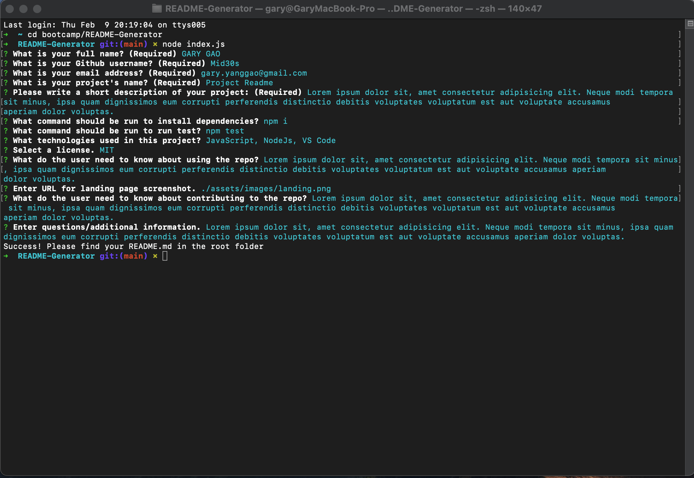
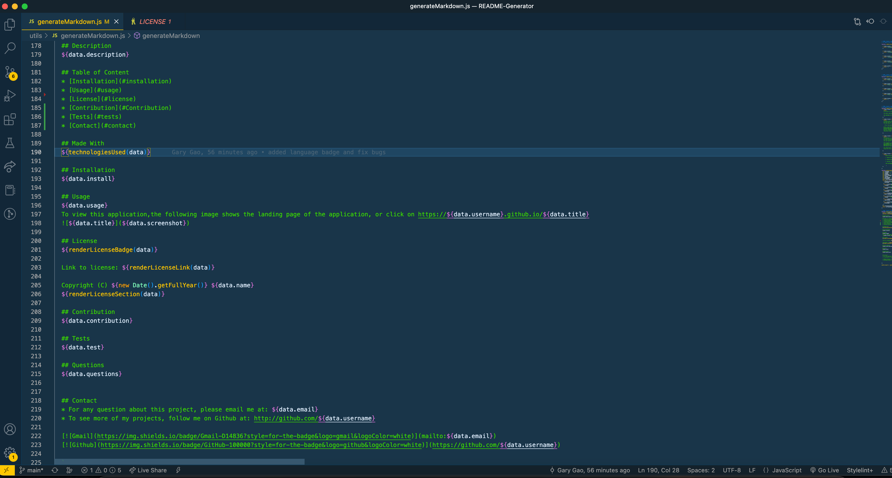
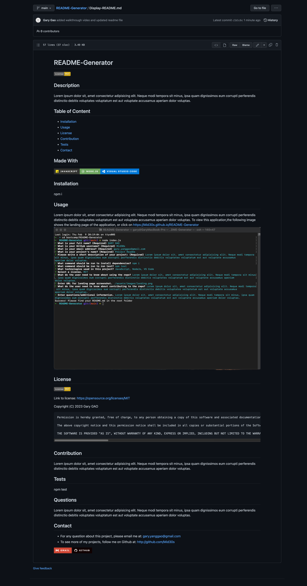

# README-Generator
  
  
  ## Description
 This project involves creating a command-line application in Node.js that generates a professional README file. The tool used in this project is the Inquirer package, which is a popular command-line user interface library for Node.js. The Inquirer package allows the project creator to interact with the user and gather information through the command line, which is then used to generate the README file.

One of the lessons learned from this project is the importance of gathering user input in a structured and organized manner. The use of the Inquirer package makes it easy to gather information from the user in a well-formatted way, ensuring that the generated README file is of high quality.

One of the difficulties faced in this project was ensuring that the generated README file was formatted correctly and contained all of the necessary information. This required careful planning and attention to detail, as well as a good understanding of the requirements for a high-quality README file. However, with the use of the Inquirer package, this task was made easier, as the information gathered from the user was well-structured and organized.

In conclusion, this project provides valuable experience in creating a command-line application and highlights the importance of gathering user input in a structured and organized manner. The use of the Inquirer package makes it easy to gather information from the user and ensures that the generated README file is of high quality.
  ## Table of Content
  * [Installation](#installation)
  * [Usage](#usage)
  * [Credits](#credits)
  * [License](#license)
  
  ## Made With
  
  
  
  
  ## Installation  
  ```
  npm i
  ```

  ## Usage
 To view this application,the following image shows the landing page of the application, or click on the walkthrough video that demonstrates the functionality of this project: https://drive.google.com/file/d/1L33-r6a5yTyH0wq2Pwixjmd5ZAkNTDTB/view
  
  
  

  ## License
  

  Link to license: https://opensource.org/licenses/MIT 

  ```
  Copyright (C) 2023 Gary GAO

  Permission is hereby granted, free of charge, to any person obtaining a copy of this software and associated documentation files (the "Software"), to deal in the Software without restriction, including without limitation the rights to use, copy, modify, merge, publish, distribute, sublicense, and/or sell copies of the Software, and to permit persons to whom the Software is furnished to do so, subject to the following conditions:

  The above copyright notice and this permission notice shall be included in all copies or substantial portions of the Software.

  THE SOFTWARE IS PROVIDED "AS IS", WITHOUT WARRANTY OF ANY KIND, EXPRESS OR IMPLIED, INCLUDING BUT NOT LIMITED TO THE WARRANTIES OF MERCHANTABILITY, FITNESS FOR A PARTICULAR PURPOSE AND NONINFRINGEMENT. IN NO EVENT SHALL THE AUTHORS OR COPYRIGHT HOLDERS BE LIABLE FOR ANY CLAIM, DAMAGES OR OTHER LIABILITY, WHETHER IN AN ACTION OF CONTRACT, TORT OR OTHERWISE, ARISING FROM, OUT OF OR IN CONNECTION WITH THE SOFTWARE OR THE USE OR OTHER DEALINGS IN THE SOFTWARE.
  ```
  
  ## Contribution
  Thanks for the start code provided by the web bootcamp.

  ## Tests
  ```
  npm test
  ```
  ## Questions
  N/A

  ## Contact
  * For any question about this project, please email me at: gary.yanggao@gmail.com
  * To see more of my projects, follow me on Github at: http://github.com/Mid30s
  
  [](mailto:gary.yanggao@gmail.com)
  [](https://github.com/Mid30s) 

  